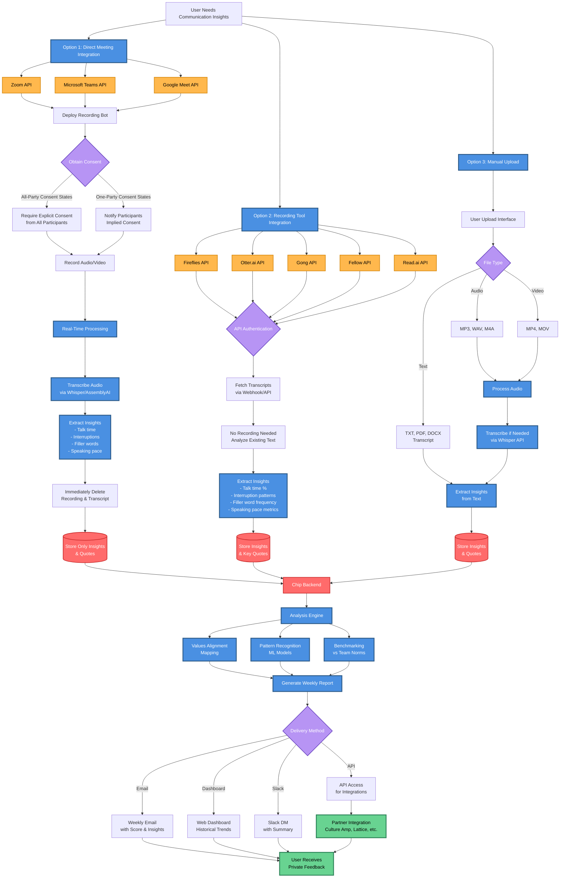

# Integration Options Flowchart

```mermaid
graph TB
    Start[User Needs Communication Insights]
    
    Start --> Option1[Option 1: Direct Meeting Integration]
    Start --> Option2[Option 2: Recording Tool Integration]
    Start --> Option3[Option 3: Manual Upload]
    
    %% Option 1: Direct Meeting Integration
    Option1 --> Zoom[Zoom API]
    Option1 --> Teams[Microsoft Teams API]
    Option1 --> Meet[Google Meet API]
    
    Zoom --> Bot1[Deploy Recording Bot]
    Teams --> Bot1
    Meet --> Bot1
    
    Bot1 --> Consent1{Obtain Consent}
    Consent1 -->|All-Party Consent States| Consent1a[Require Explicit Consent<br/>from All Participants]
    Consent1 -->|One-Party Consent States| Consent1b[Notify Participants<br/>Implied Consent]
    Consent1a --> Record1[Record Audio/Video]
    Consent1b --> Record1
    
    Record1 --> Process1[Real-Time Processing]
    Process1 --> Transcribe1[Transcribe Audio<br/>via Whisper/AssemblyAI]
    Transcribe1 --> Extract1[Extract Insights<br/>- Talk time<br/>- Interruptions<br/>- Filler words<br/>- Speaking pace]
    Extract1 --> Delete1[Immediately Delete<br/>Recording & Transcript]
    Delete1 --> Store1[(Store Only Insights<br/>& Quotes)]
    
    %% Option 2: Recording Tool Integration
    Option2 --> Fireflies[Fireflies API]
    Option2 --> Otter[Otter.ai API]
    Option2 --> Gong[Gong API]
    Option2 --> Fellow[Fellow API]
    Option2 --> Read[Read.ai API]
    
    Fireflies --> Auth2{API Authentication}
    Otter --> Auth2
    Gong --> Auth2
    Fellow --> Auth2
    Read --> Auth2
    
    Auth2 --> Fetch2[Fetch Transcripts<br/>via Webhook/API]
    Fetch2 --> NoRecord[No Recording Needed<br/>Analyze Existing Text]
    NoRecord --> Extract2[Extract Insights<br/>- Talk time %<br/>- Interruption patterns<br/>- Filler word frequency<br/>- Speaking pace metrics]
    Extract2 --> Store2[(Store Insights<br/>& Key Quotes)]
    
    %% Option 3: Manual Upload
    Option3 --> Upload[User Upload Interface]
    Upload --> FileType{File Type}
    
    FileType -->|Audio| Audio[MP3, WAV, M4A]
    FileType -->|Video| Video[MP4, MOV]
    FileType -->|Text| Text[TXT, PDF, DOCX<br/>Transcript]
    
    Audio --> Process3[Process Audio]
    Video --> Process3
    Text --> Extract3[Extract Insights<br/>from Text]
    
    Process3 --> Transcribe3[Transcribe if Needed<br/>via Whisper API]
    Transcribe3 --> Extract3
    Extract3 --> Store3[(Store Insights<br/>& Quotes)]
    
    %% Backend Processing
    Store1 --> Backend[Chip Backend]
    Store2 --> Backend
    Store3 --> Backend
    
    Backend --> Analyze[Analysis Engine]
    Analyze --> Values[Values Alignment<br/>Mapping]
    Analyze --> Patterns[Pattern Recognition<br/>ML Models]
    Analyze --> Benchmarks[Benchmarking<br/>vs Team Norms]
    
    Values --> Report[Generate Weekly Report]
    Patterns --> Report
    Benchmarks --> Report
    
    %% Frontend Delivery
    Report --> Frontend{Delivery Method}
    
    Frontend -->|Email| Email[Weekly Email<br/>with Score & Insights]
    Frontend -->|Dashboard| Dashboard[Web Dashboard<br/>Historical Trends]
    Frontend -->|Slack| Slack[Slack DM<br/>with Summary]
    Frontend -->|API| API[API Access<br/>for Integrations]
    
    Email --> User[User Receives<br/>Private Feedback]
    Dashboard --> User
    Slack --> User
    API --> Partner[Partner Integration<br/>Culture Amp, Lattice, etc.]
    Partner --> User
    
    %% Styling
    classDef optionStyle fill:#4A90E2,stroke:#2E5C8A,stroke-width:3px,color:#fff
    classDef processStyle fill:#50C878,stroke:#2D7A4A,stroke-width:2px,color:#fff
    classDef storageStyle fill:#FF6B6B,stroke:#C92A2A,stroke-width:2px,color:#fff
    classDef toolStyle fill:#FFB84D,stroke:#D68910,stroke-width:2px,color:#000
    classDef decisionStyle fill:#B794F4,stroke:#6B46C1,stroke-width:2px,color:#fff
    classDef userStyle fill:#68D391,stroke:#2F855A,stroke-width:3px,color:#000
    
    class Option1,Option2,Option3 optionStyle
    class Process1,Process3,Transcribe1,Transcribe3,Extract1,Extract2,Extract3,Analyze,Values,Patterns,Benchmarks,Report optionStyle
    class Store1,Store2,Store3,Backend storageStyle
    class Zoom,Teams,Meet,Fireflies,Otter,Gong,Fellow,Read toolStyle
    class Consent1,Auth2,FileType,Frontend decisionStyle
    class User,Partner userStyle
```
