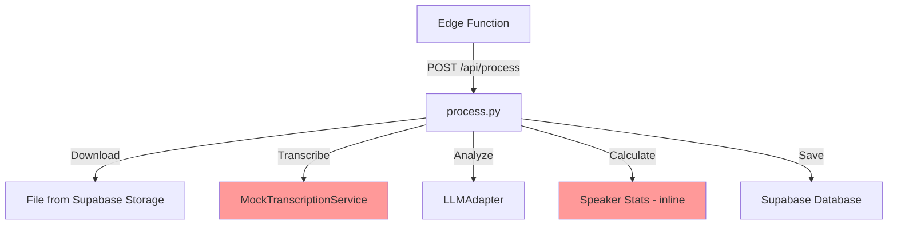
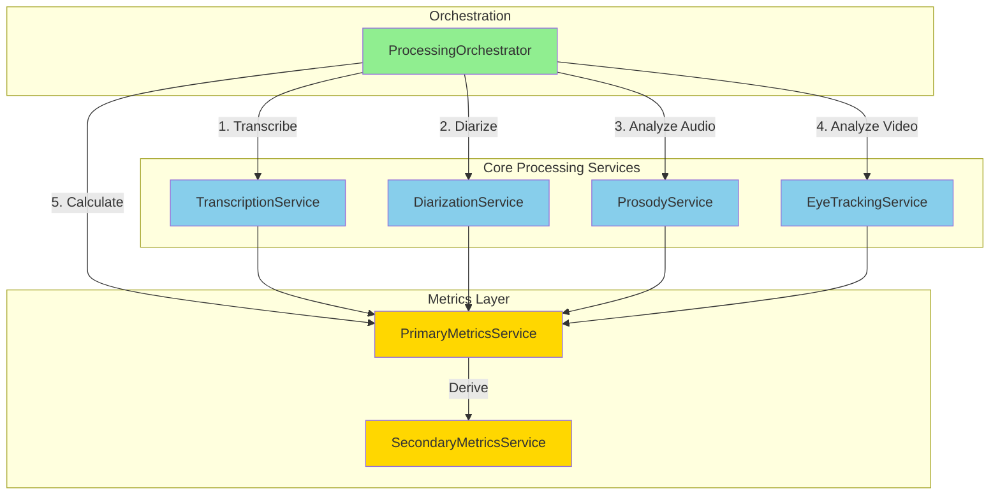
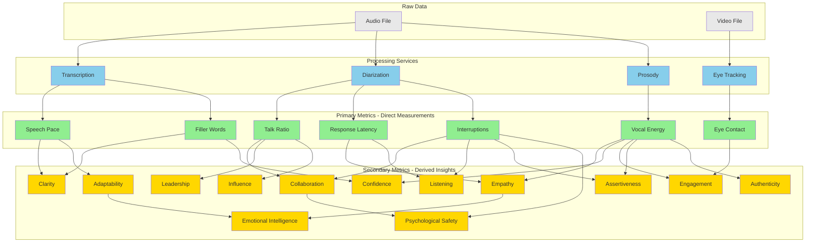
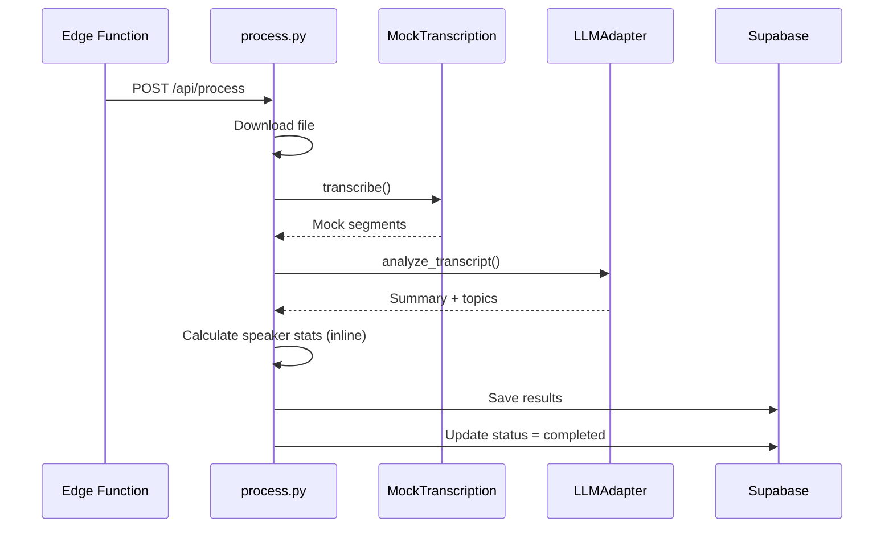
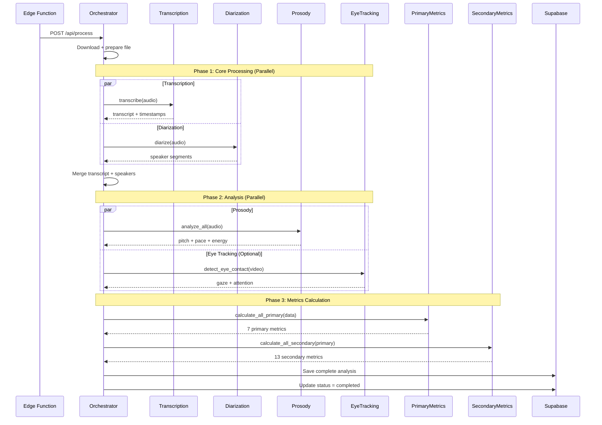

# Python Backend Architecture Plan

## Executive Summary

This document outlines the modularization plan for the Python backend processing pipeline. The goal is to create a scalable, maintainable architecture that supports multiple communication metrics through independent, composable services.

**Current State:** Monolithic processing with mock transcription and basic speaker statistics.

**Target State:** Modular pipeline with real ML services (transcription, diarization, prosody, eye tracking) supporting 13+ communication metrics.

---

## Table of Contents

1. [Current Architecture](#current-architecture)
2. [Target Architecture](#target-architecture)
3. [Service Modularization Plan](#service-modularization-plan)
4. [Metrics Framework](#metrics-framework)
5. [Processing Pipeline](#processing-pipeline)
6. [Implementation Phases](#implementation-phases)
7. [Data Flow](#data-flow)

---

## Current Architecture

### Current Implementation Status

**What's Working:**
- ✅ FastAPI application with async processing
- ✅ Supabase integration (database operations)
- ✅ Multi-provider LLM adapter (Gemini, OpenAI, Anthropic)
- ✅ Mock transcription service (for development)
- ✅ Basic speaker statistics calculation (talk ratio)
- ✅ Background job processing
- ✅ API key authentication
- ✅ File download from signed URLs

**What's Not Implemented:**
- ❌ Real transcription (WhisperX) - using mock data
- ❌ Speaker diarization (pyannote.audio) - skeleton only
- ❌ All advanced metrics (only basic talk ratio works)
- ❌ Prosody analysis - removed skeleton files
- ❌ Eye tracking - removed skeleton files
- ❌ Primary metrics service - removed skeleton files
- ❌ Secondary metrics service - removed skeleton files

### Current Processing Flow



**Legend:** 🔴 Red = Mock/Incomplete Implementation

### Current Focus: MVP First

**Decision:** Start with one complete vertical slice rather than maintaining skeleton files.

**Phase 1 MVP:**
1. Real transcription (WhisperX)
2. Real diarization (pyannote.audio)
3. Talk ratio metric (from diarization data)
4. Complete end-to-end flow with real audio

**Why This Approach:**
- Deliver working features faster
- Validate architecture with real data
- Less maintenance burden (no skeleton files)
- Clear progress for stakeholders
- Easier debugging with smaller scope

### Current File Structure

```
python-backend/
├── app/
│   ├── __init__.py
│   ├── main.py                      # FastAPI app initialization
│   ├── config.py                    # Settings and environment variables
│   │
│   ├── middleware/
│   │   ├── __init__.py
│   │   └── auth.py                  # API key authentication
│   │
│   ├── routes/                      # API endpoints
│   │   ├── __init__.py
│   │   ├── health.py                # Health check endpoint
│   │   ├── process.py               # Main processing endpoint
│   │   ├── analysis.py              # Analysis query endpoints
│   │   ├── audio.py                 # Audio operations (future)
│   │   └── video.py                 # Video operations (future)
│   │
│   └── services/                    # Business logic
│       ├── __init__.py
│       ├── supabase_client.py       # Database operations
│       │
│       ├── llm/                     # AI provider integration
│       │   ├── __init__.py
│       │   ├── llm_adapter.py       # Provider selection logic
│       │   └── providers/
│       │       ├── __init__.py
│       │       ├── base.py          # Abstract provider interface
│       │       ├── gemini.py        # Google Gemini implementation
│       │       └── openai.py        # OpenAI implementation
│       │
│       ├── audio/                   # Audio processing services
│       │   ├── __init__.py
│       │   ├── transcription.py     # 🔴 Mock (needs WhisperX)
│       │   ├── mock_transcription.py # Mock data generator
│       │   └── diarization.py       # 🔴 Skeleton (needs pyannote)
│       │
│       ├── video/                   # Video processing services
│       │   ├── __init__.py
│       │   └── face_detection.py    # 🔴 Not implemented
│       │
│       └── analysis/                # Metrics calculation (future)
│           └── __init__.py
│
├── requirements.txt                 # Python dependencies
├── Dockerfile                       # Container configuration
├── .env                             # Local environment variables
├── .env.deploy                      # Production environment template
└── deploy.sh                        # Cloud Run deployment script
```

**Legend:**
- ✅ Implemented and working
- 🔴 Needs implementation
- 📋 Placeholder for future features

### Target File Structure (After All Phases)

```
python-backend/
├── app/
│   ├── __init__.py
│   ├── main.py
│   ├── config.py
│   │
│   ├── middleware/
│   │   ├── __init__.py
│   │   └── auth.py
│   │
│   ├── routes/
│   │   ├── __init__.py
│   │   ├── health.py
│   │   ├── process.py               # Main orchestrator
│   │   ├── analysis.py
│   │   ├── audio.py
│   │   └── video.py
│   │
│   └── services/
│       ├── __init__.py
│       ├── supabase_client.py
│       │
│       ├── orchestrator/            # Phase 5: Orchestration logic
│       │   ├── __init__.py
│       │   └── processing_orchestrator.py
│       │
│       ├── llm/                     # ✅ Working
│       │   ├── __init__.py
│       │   ├── llm_adapter.py
│       │   └── providers/
│       │       ├── __init__.py
│       │       ├── base.py
│       │       ├── gemini.py
│       │       ├── openai.py
│       │       └── anthropic.py
│       │
│       ├── audio/                   # Phase 1-3: Audio processing
│       │   ├── __init__.py
│       │   ├── transcription.py     # Phase 1: WhisperX
│       │   ├── diarization.py       # Phase 1: pyannote
│       │   ├── prosody.py           # Phase 3: librosa
│       │   └── voice_metrics.py     # Phase 3: Filler detection
│       │
│       ├── video/                   # Phase 6: Video processing
│       │   ├── __init__.py
│       │   ├── face_detection.py
│       │   └── eye_tracking.py      # MediaPipe
│       │
│       └── analysis/                # Phase 2 & 4: Metrics
│           ├── __init__.py
│           ├── primary_metrics.py   # Phase 2: Direct measurements
│           └── secondary_metrics.py # Phase 4: Derived insights
│
├── tests/                           # Testing infrastructure
│   ├── __init__.py
│   ├── test_transcription.py
│   ├── test_diarization.py
│   ├── test_metrics.py
│   └── fixtures/
│       └── sample_audio.wav
│
├── requirements.txt
├── Dockerfile
├── .env
├── .env.deploy
├── deploy.sh
└── ARCHITECTURE_PLAN.md            # This document
```

**Phase-by-Phase Evolution:**

**Phase 1 (MVP):** Add to `services/audio/`
- Create API provider abstraction pattern
- Implement `transcription.py` with AssemblyAI provider
- Remove `diarization.py` (handled by AssemblyAI)
- Calculate talk ratio, response latency, interruptions in `process.py`

**Phase 2:** Add `services/analysis/`
- Create `primary_metrics.py`
- Move metrics logic out of `process.py`

**Phase 3:** Expand `services/audio/`
- Add `prosody.py` (pitch, pace, energy)
- Add `voice_metrics.py` (filler words)

**Phase 4:** Expand `services/analysis/`
- Add `secondary_metrics.py`
- Implement 13 derived metrics

**Phase 5:** Add `services/orchestrator/`
- Extract orchestration from `process.py`
- Create `ProcessingOrchestrator` class

**Phase 6:** Expand `services/video/`
- Implement `eye_tracking.py`
- Implement `face_detection.py`

---

## Target Architecture

### Modular Service Architecture



### Design Principles

1. **Single Responsibility:** Each service handles one domain
2. **Composability:** Services can be used independently
3. **Testability:** Services can be mocked and tested in isolation
4. **Extensibility:** New services and metrics can be added easily
5. **Graceful Degradation:** Optional services can fail without breaking the pipeline

---

## Service Modularization Plan

### 1. TranscriptionService

**Purpose:** Convert audio to text with word-level timestamps

**Current Status:** 🔴 Mock implementation

**Target Implementation (Phase 1):**
- API provider abstraction pattern (similar to LLM adapter)
- AssemblyAI provider (transcription + diarization)
- Word-level timestamps
- Speaker labels
- Language detection

**Interface:**
```python
class TranscriptionService:
    def __init__(self, provider: str = "assemblyai"):
        """Initialize with API provider (assemblyai, deepgram, etc.)"""

    def transcribe(
        audio_path: Path,
        language: Optional[str] = None,
        enable_diarization: bool = True
    ) -> TranscriptionResult:
        """
        Returns:
            - text: Full transcript
            - segments: List of segments with timestamps and speakers
            - words: Word-level timing
            - speakers: List of detected speakers
            - language: Detected/specified language
            - confidence: Overall confidence score
        """
```

**Dependencies (Phase 1):**
- `assemblyai>=0.25.0`
- `httpx>=0.26.0` (for API calls)

**Dependencies (Phase 1b - Future Self-Hosted):**
- `whisperx>=3.1.0`
- `faster-whisper>=0.9.0`
- `torch>=2.0.0`

---

### 2. DiarizationService *(REMOVED - Handled by TranscriptionService)*

**Decision:** AssemblyAI and similar APIs provide transcription + diarization in one service, so we don't need a separate DiarizationService.

**Previous Plan:** Separate service using pyannote.audio

**Current Approach:** Speaker labels are included in TranscriptionService API response

**Benefits:**
- Simpler architecture (one service instead of two)
- No need to merge separate transcription + diarization results
- Better speaker-transcript alignment from API
- One API call instead of two operations

**Note:** If we move to self-hosted ML (Phase 1b), we would re-introduce this service with pyannote.audio.

---

### 3. ProsodyService

**Purpose:** Analyze vocal characteristics (pitch, pace, energy)

**Current Status:** 🔴 Not implemented (empty skeleton)

**Target Implementation:**
- Pitch analysis (F0 extraction)
- Speech rate calculation
- Energy/intensity analysis
- Vocal expressiveness metrics

**Interface:**
```python
class ProsodyService:
    def analyze_pitch(audio_path: Path) -> PitchAnalysis:
        """Mean pitch, range, variation"""

    def analyze_speech_rate(
        audio_path: Path,
        transcription: str
    ) -> SpeechRateAnalysis:
        """WPM, syllables/sec"""

    def analyze_energy(audio_path: Path) -> EnergyAnalysis:
        """RMS energy, dynamic range"""

    def analyze_all(
        audio_path: Path,
        transcription: Optional[str] = None
    ) -> ProsodyAnalysis:
        """Combined prosody metrics"""
```

**Dependencies:**
- `librosa>=0.10.0`
- `praat-parselmouth>=0.4.0`
- `soundfile>=0.12.0`

---

### 4. EyeTrackingService

**Purpose:** Track gaze direction and estimate eye contact

**Current Status:** 🔴 Not implemented (empty skeleton)

**Target Implementation:**
- Face landmark detection
- Gaze direction estimation
- Eye contact detection (looking at camera)
- Attention scoring

**Interface:**
```python
class EyeTrackingService:
    def detect_eye_contact(
        video_path: Path,
        sample_rate: int = 5
    ) -> EyeContactResult:
        """
        Returns:
            - eye_contact_percentage: % time looking at camera
            - segments: Timestamp ranges
            - per_speaker: Individual metrics
        """

    def calculate_attention_score(
        eye_contact_data: Dict,
        duration: float
    ) -> float:
        """Attention score 0-100"""
```

**Dependencies:**
- `mediapipe>=0.10.0`
- `opencv-python>=4.9.0`

---

### 5. PrimaryMetricsService

**Purpose:** Calculate direct measurements from raw data

**Current Status:** 🔴 Not implemented (all methods raise NotImplementedError)

**Metrics Calculated:**
1. **Talk Ratio** - Speaking time per speaker
2. **Response Latency** - Gaps between speaker turns
3. **Speech Pace** - Words per minute, syllables per second
4. **Filler Words** - Frequency of um, uh, like, etc.
5. **Vocal Energy** - Voice intensity and range
6. **Eye Contact** - Camera attention percentage
7. **Interruptions** - Overlapping speech events

**Interface:**
```python
class PrimaryMetricsService:
    def calculate_talk_ratio(
        diarization: DiarizationResult,
        total_duration: float
    ) -> Dict[str, float]:
        """Speaking time % per speaker"""

    def calculate_response_latency(
        diarization: DiarizationResult
    ) -> ResponseLatencyMetrics:
        """Average gaps, distribution"""

    def calculate_speech_pace(
        prosody: ProsodyAnalysis,
        transcription: str
    ) -> SpeechPaceMetrics:
        """WPM, pace category"""

    # ... (see interface section for full list)
```

---

### 6. SecondaryMetricsService

**Purpose:** Derive high-level insights from primary metrics

**Current Status:** 🔴 Not implemented

**Metrics Calculated:**
1. **Clarity Score** - Derived from speech pace + filler words
2. **Empathy Index** - From vocal energy + response latency
3. **Confidence Index** - From vocal energy + pitch + filler words
4. **Collaboration Ratio** - From talk ratio + interruptions
5. **Leadership Score** - From talk ratio + influence patterns
6. **Listening Score** - From response latency + interruptions
7. **Engagement Score** - From eye contact + vocal energy
8. **Assertiveness** - From interruptions + vocal energy
9. **Adaptability** - From speech pace variation + response patterns
10. **Influence Score** - From talk ratio + collaboration patterns
11. **Authenticity** - From prosody variation + consistency
12. **Emotional Intelligence** - From empathy + adaptability
13. **Psychological Safety** - From collaboration + interruption patterns

**Interface:**
```python
class SecondaryMetricsService:
    def calculate_clarity_score(
        speech_pace: float,
        filler_rate: float
    ) -> float:
        """0-100 score"""

    def calculate_empathy_index(
        vocal_energy: Dict,
        response_latency: Dict
    ) -> float:
        """0-100 score"""

    def calculate_all_secondary_metrics(
        primary_metrics: Dict[str, Any]
    ) -> Dict[str, float]:
        """All 13 secondary metrics"""
```

---

## Metrics Framework

### Metric Classification



### Metric Dependency Matrix

| Secondary Metric | Primary Metrics Used | Formula/Logic |
|------------------|---------------------|---------------|
| **Clarity** | Speech Pace + Filler Words | `100 - (filler_rate * 10) - abs(pace - optimal) * 5` |
| **Empathy** | Vocal Energy + Response Latency | `(energy_variation * 0.6) + (quick_responses * 0.4)` |
| **Confidence** | Vocal Energy + Pitch + Filler Words | `(energy * 0.4) + (pitch_stability * 0.3) + (100 - filler_rate * 20) * 0.3` |
| **Collaboration** | Talk Ratio + Interruptions | `balance_score * (1 - disruptive_interruptions)` |
| **Leadership** | Talk Ratio + Influence Patterns | `(talk_time * 0.5) + (influence_score * 0.5)` |
| **Listening** | Response Latency + Interruptions | `(appropriate_latency * 0.6) + (1 - interruption_rate) * 0.4` |
| **Engagement** | Eye Contact + Vocal Energy | `(eye_contact * 0.5) + (energy * 0.5)` |
| **Assertiveness** | Interruptions + Vocal Energy | `(supportive_interruptions * 0.4) + (energy * 0.6)` |
| **Adaptability** | Speech Pace Variation + Response | `pace_flexibility * response_flexibility` |
| **Influence** | Talk Ratio + Collaboration | `(talk_quality * 0.6) + (collaboration * 0.4)` |
| **Authenticity** | Prosody Variation + Consistency | `(variation * 0.5) + (consistency * 0.5)` |
| **Emotional Intelligence** | Empathy + Adaptability | `(empathy * 0.6) + (adaptability * 0.4)` |
| **Psychological Safety** | Collaboration + Interruptions | `collaboration * (1 - negative_interruptions)` |

---

## Processing Pipeline

### Current Pipeline (Monolithic)



### Target Pipeline (Modular)



### Processing Stages

#### Stage 1: File Preparation (Sequential)
1. Download file from signed URL
2. Extract audio track (if video)
3. Normalize audio format
4. Validate file integrity

#### Stage 2: Core Processing (Parallel)
Run simultaneously:
- **Transcription:** WhisperX on audio
- **Diarization:** pyannote.audio on audio

Then merge results: Assign speaker labels to transcript segments

#### Stage 3: Analysis (Parallel)
Run simultaneously:
- **Prosody Analysis:** librosa on audio (pitch, pace, energy)
- **Eye Tracking:** MediaPipe on video frames (optional, only for video)

#### Stage 4: Primary Metrics (Sequential)
Calculate from processed data:
1. Talk Ratio (from diarization)
2. Response Latency (from diarization)
3. Speech Pace (from prosody + transcript)
4. Filler Words (from transcript)
5. Vocal Energy (from prosody)
6. Eye Contact (from eye tracking, if available)
7. Interruptions (from diarization)

#### Stage 5: Secondary Metrics (Sequential)
Derive from primary metrics:
1. Clarity Score
2. Empathy Index
3. Confidence Index
4. Collaboration Ratio
5. Leadership Score
6. Listening Score
7. Engagement Score
8. Assertiveness
9. Adaptability
10. Influence Score
11. Authenticity
12. Emotional Intelligence
13. Psychological Safety

#### Stage 6: Persistence (Sequential)
1. Save analysis to `meeting_analysis` table
2. Update job status to `completed`
3. Cleanup temporary files

---

## Data Flow

### Input: ProcessJobRequest

```python
{
    "job_id": "uuid",
    "user_id": "uuid",
    "file_url": "https://...",  # Signed URL (2hr expiry)
    "original_filename": "meeting.mp4",
    "storage_path": "recordings/{user}/{year}/{month}/{job}.mp4"
}
```

### Stage 1 Output: File Preparation

```python
{
    "audio_path": Path("/tmp/job_uuid/audio.wav"),
    "video_path": Path("/tmp/job_uuid/video.mp4"),  # Optional
    "duration": 300.5,  # seconds
    "sample_rate": 16000,
    "channels": 1
}
```

### Stage 2 Output: Transcription + Diarization

```python
{
    "text": "Full transcript...",
    "segments": [
        {
            "start": 0.0,
            "end": 3.5,
            "text": "Hello everyone",
            "speaker": "SPEAKER_00",
            "words": [
                {"word": "Hello", "start": 0.0, "end": 0.5},
                {"word": "everyone", "start": 0.6, "end": 1.2}
            ],
            "confidence": 0.95
        }
    ],
    "speakers": ["SPEAKER_00", "SPEAKER_01", "SPEAKER_02"],
    "num_speakers": 3,
    "language": "en"
}
```

### Stage 3 Output: Prosody + Eye Tracking

```python
{
    "prosody": {
        "pitch": {
            "mean": 120.5,  # Hz
            "range": 80.0,
            "std": 15.2,
            "variation": 0.65  # normalized
        },
        "speech_rate": {
            "words_per_minute": 145,
            "syllables_per_second": 4.2,
            "pace_category": "normal"
        },
        "energy": {
            "mean": 0.42,
            "range": 0.35,
            "dynamic_range_db": 12.5
        }
    },
    "eye_tracking": {  # Optional
        "eye_contact_percentage": 67.5,
        "attention_score": 72.0,
        "per_speaker": {
            "SPEAKER_00": 75.0,
            "SPEAKER_01": 60.0
        }
    }
}
```

### Stage 4 Output: Primary Metrics

```python
{
    "talk_ratio": {
        "SPEAKER_00": 45.2,  # %
        "SPEAKER_01": 35.8,
        "SPEAKER_02": 19.0
    },
    "response_latency": {
        "average_seconds": 0.85,
        "distribution": [0.5, 0.7, 0.9, 1.2, ...],
        "quick_responses_percentage": 65.0  # <1s
    },
    "speech_pace": {
        "overall_wpm": 145,
        "per_speaker": {
            "SPEAKER_00": 155,
            "SPEAKER_01": 140,
            "SPEAKER_02": 130
        }
    },
    "filler_words": {
        "total_count": 42,
        "rate_per_minute": 8.4,
        "percentage_of_words": 2.1,
        "by_type": {"um": 15, "uh": 12, "like": 10, "you know": 5}
    },
    "vocal_energy": {
        "mean": 0.42,
        "variation": 0.35,
        "expressiveness_score": 68.0
    },
    "eye_contact": {
        "overall_percentage": 67.5,
        "per_speaker": {...}
    },
    "interruptions": {
        "total_count": 12,
        "rate_per_minute": 2.4,
        "supportive": 7,
        "disruptive": 5,
        "matrix": {
            "SPEAKER_00": {"interrupted_by": {"SPEAKER_01": 3, "SPEAKER_02": 2}},
            ...
        }
    }
}
```

### Stage 5 Output: Secondary Metrics

```python
{
    "clarity": 78.5,
    "empathy": 72.0,
    "confidence": 68.5,
    "collaboration": 75.0,
    "leadership": 70.0,
    "listening": 73.5,
    "engagement": 71.0,
    "assertiveness": 65.0,
    "adaptability": 69.0,
    "influence": 72.5,
    "authenticity": 74.0,
    "emotional_intelligence": 71.0,
    "psychological_safety": 76.0,
    "overall_score": 72.3  # Average of all
}
```

### Final Database Record: meeting_analysis

```python
{
    "job_id": "uuid",
    "user_id": "uuid",
    "transcript": {...},  # From Stage 2
    "summary": "AI-generated summary",
    "speaker_stats": {...},  # From Stage 4 (talk_ratio)
    "communication_metrics": {
        "primary": {...},  # All Stage 4 metrics
        "secondary": {...},  # All Stage 5 metrics
        "overall_score": 72.3
    },
    "behavioral_insights": {
        "prosody": {...},
        "eye_tracking": {...},
        "patterns": [...]
    },
    "created_at": "2025-01-15T10:30:00Z"
}
```

---

## Implementation Phases

### Phase 0: Foundation (Current - Complete ✅)
- [x] FastAPI setup
- [x] Supabase integration
- [x] LLM adapter pattern
- [x] Basic routing and auth
- [x] Mock transcription for testing

### Phase 1: API-First Transcription & Diarization (High Priority 🔴)

**Goal:** Replace mock with real transcription and diarization using APIs

**Decision:** Use APIs instead of self-hosted ML to ship faster and reduce infrastructure complexity.

**Tasks:**
1. Create API provider abstraction for transcription services
2. Implement AssemblyAI provider (transcription + diarization in one)
3. Update TranscriptionService to use API provider
4. Remove DiarizationService (AssemblyAI handles both)
5. Calculate talk ratio from API response
6. Test with real audio files
7. Deploy (lightweight - no ML dependencies)

**Services:**
- ✅ TranscriptionService (with API provider pattern)
- ✅ API Providers: AssemblyAI (primary)

**API Choice:**
- **AssemblyAI** - Best all-in-one (transcription + speaker diarization + word-level timestamps)
  - Cost: ~$0.37 per hour of audio
  - Fast processing (~15-25% of audio duration)
  - Simple REST API
  - Optional: speaker identification, sentiment, content moderation

**Alternative APIs (future consideration):**
- Deepgram - Faster, similar pricing
- Rev.ai - Higher accuracy, more expensive
- Google Speech-to-Text - Diarization in beta

**Metrics Unlocked:**
- Talk Ratio (per speaker)
- Response Latency (gaps between speakers)
- Interruptions (overlapping speech)

**Benefits:**
- ✅ Ship in days instead of weeks
- ✅ No ML infrastructure to manage
- ✅ Pay-per-use pricing (cheaper at low volume)
- ✅ Easy to test and debug
- ✅ Can switch to self-hosted later if volume justifies it

**Estimated Time:** 3-5 days

---

### Phase 1b (Future): Self-Hosted ML Pipeline (Optional)

**When to consider:** If monthly audio processing > 500 hours (~$185/month in API costs)

**Goal:** Replace API with self-hosted WhisperX + pyannote

**Tasks:**
1. Implement WhisperXProvider
2. Implement pyannote diarization
3. Add ML dependencies to requirements.txt (~2GB)
4. Update Cloud Run config (more memory, possible GPU)
5. Implement model caching strategy
6. A/B test quality vs. API

**Trade-offs:**
- Higher infrastructure cost (Cloud Run with 4GB+ memory)
- Longer cold starts (model loading)
- More maintenance (model updates, debugging)
- Better margins at high volume

**Estimated Time:** 2-3 weeks

---

### Phase 2: Primary Metrics (High Priority 🟡)

**Goal:** Calculate 7 direct measurements from ML output

**Tasks:**
1. Implement PrimaryMetricsService
2. Calculate talk ratio (enhanced)
3. Calculate response latency
4. Detect interruptions
5. Count filler words
6. Calculate speech pace (basic)

**Services:**
- ✅ PrimaryMetricsService (7 methods)

**Metrics Unlocked:**
- Talk Ratio (enhanced)
- Response Latency
- Interruptions
- Filler Words
- Speech Pace (basic)

**Estimated Time:** 1-2 weeks

---

### Phase 3: Prosody Analysis (Medium Priority 🟠)

**Goal:** Add vocal characteristic analysis

**Tasks:**
1. Implement ProsodyService
2. Extract pitch (F0) with librosa
3. Calculate speech rate with syllable counting
4. Analyze vocal energy (RMS)
5. Calculate pitch variation
6. Integrate with PrimaryMetricsService

**Services:**
- ✅ ProsodyService

**Metrics Unlocked:**
- Vocal Energy
- Speech Pace (enhanced with prosody)

**Estimated Time:** 1-2 weeks

---

### Phase 4: Secondary Metrics (Medium Priority 🟠)

**Goal:** Derive 13 high-level insights from primary metrics

**Tasks:**
1. Implement SecondaryMetricsService
2. Create formulas for each metric
3. Test metric calculations
4. Validate against expected ranges
5. Document scoring methodology

**Services:**
- ✅ SecondaryMetricsService

**Metrics Unlocked:**
- Clarity, Empathy, Confidence
- Collaboration, Leadership, Listening
- Engagement, Assertiveness, Adaptability
- Influence, Authenticity
- Emotional Intelligence, Psychological Safety

**Estimated Time:** 2-3 weeks

---

### Phase 5: Orchestrator Refactor (Medium Priority 🟠)

**Goal:** Clean up monolithic process.py

**Tasks:**
1. Create ProcessingOrchestrator class
2. Extract helper methods
3. Implement parallel processing
4. Add retry logic and error handling
5. Improve logging and monitoring

**Services:**
- ✅ ProcessingOrchestrator

**Benefits:**
- Cleaner code
- Better testability
- Parallel processing (faster)
- Graceful degradation

**Estimated Time:** 1 week

---

### Phase 6: Eye Tracking (Low Priority 🔵)

**Goal:** Add visual attention tracking (video only)

**Tasks:**
1. Implement EyeTrackingService
2. Face landmark detection with MediaPipe
3. Gaze direction estimation
4. Eye contact detection
5. Attention scoring

**Services:**
- ✅ EyeTrackingService

**Metrics Unlocked:**
- Eye Contact
- Engagement (enhanced with eye tracking)

**Estimated Time:** 2-3 weeks

---

### Phase 7: Advanced Features (Future 🔮)

**Potential Additions:**
- Real-time processing (streaming)
- Multi-language support (expand beyond English)
- Custom metric definitions (user-configurable)
- Facial expression analysis
- Gesture recognition
- Sentiment analysis (beyond vocal)
- Team dynamics patterns
- Historical trend analysis

---

## Next Steps

### Immediate Actions (Week 1)

1. **Review and Approve Plan**
   - Stakeholder review
   - Technical review
   - Prioritization confirmation

2. **Start CHI-22 (Phase 1)**
   - Set up WhisperX locally
   - Test transcription with sample files
   - Implement DiarizationService
   - Test speaker label assignment

3. **Infrastructure Prep**
   - Update requirements.txt
   - Test Docker build with ML dependencies
   - Update Cloud Run configuration (memory, timeout)
   - Plan for model caching (reduce cold starts)

### Success Metrics

**Phase 1 (MVP):**
- ✅ Real transcription working (not mock)
- ✅ Speaker diarization accurate (>80%)
- ✅ Talk ratio calculated correctly
- ✅ Processing time <5 minutes for 10-min meeting

**Phase 2:**
- ✅ All 7 primary metrics calculated
- ✅ Metrics validated against ground truth
- ✅ Processing time <7 minutes for 10-min meeting

**Phase 4:**
- ✅ All 13 secondary metrics derived
- ✅ Metrics show meaningful variation across meetings
- ✅ Dashboard displays all metrics clearly

### Technical Debt & Considerations

**Performance:**
- ML models are large (~2GB total)
- WhisperX is CPU/GPU intensive
- Consider GPU instances for faster processing
- Implement caching for model loading

**Scalability:**
- Current: Synchronous processing (one at a time)
- Future: Queue-based processing with workers
- Consider: Separate services for transcription vs. metrics

**Cost:**
- Google Cloud Run pricing (memory + CPU)
- Consider: Reserved instances vs. on-demand
- Model caching reduces cold start costs

**Testing:**
- Unit tests for each service
- Integration tests for orchestrator
- End-to-end tests with real files
- Metric validation tests

---

## Appendix

### Service Dependencies

**Phase 1 (API-First):**
```
TranscriptionService:
  - assemblyai>=0.25.0
  - httpx>=0.26.0

LLMAdapter:
  - openai>=1.0.0
  - google-generativeai>=0.3.0
```

**Phase 1b (Self-Hosted ML - Optional):**
```
TranscriptionService (WhisperX):
  - whisperx>=3.1.0
  - faster-whisper>=0.9.0
  - torch>=2.0.0
  - torchaudio>=2.0.0

DiarizationService (pyannote):
  - pyannote.audio>=3.0.0
  - torch>=2.0.0
  - HuggingFace token
```

**Phase 3 (Prosody Analysis):**
```
ProsodyService:
  - librosa>=0.10.0
  - praat-parselmouth>=0.4.0
  - soundfile>=0.12.0
  - numpy>=1.24.0
```

**Phase 6 (Eye Tracking):**
```
EyeTrackingService:
  - mediapipe>=0.10.0
  - opencv-python>=4.9.0
  - scipy>=1.11.0
```

### Database Schema

**meeting_analysis table:**
```sql
CREATE TABLE meeting_analysis (
    id UUID PRIMARY KEY DEFAULT uuid_generate_v4(),
    job_id UUID NOT NULL REFERENCES processing_jobs(id),
    user_id UUID NOT NULL REFERENCES users(id),
    transcript JSONB,
    summary TEXT,
    speaker_stats JSONB,
    communication_metrics JSONB,
    behavioral_insights JSONB,
    created_at TIMESTAMPTZ DEFAULT NOW()
);
```

**communication_metrics structure:**
```jsonb
{
    "primary": {
        "talk_ratio": {...},
        "response_latency": {...},
        "speech_pace": {...},
        "filler_words": {...},
        "vocal_energy": {...},
        "eye_contact": {...},
        "interruptions": {...}
    },
    "secondary": {
        "clarity": 78.5,
        "empathy": 72.0,
        "confidence": 68.5,
        "collaboration": 75.0,
        "leadership": 70.0,
        "listening": 73.5,
        "engagement": 71.0,
        "assertiveness": 65.0,
        "adaptability": 69.0,
        "influence": 72.5,
        "authenticity": 74.0,
        "emotional_intelligence": 71.0,
        "psychological_safety": 76.0
    },
    "overall_score": 72.3
}
```

---

## Glossary

**Diarization:** The process of partitioning an audio stream into segments according to speaker identity ("who spoke when")

**Prosody:** The rhythm, stress, and intonation of speech

**F0 (Fundamental Frequency):** The lowest frequency of a periodic waveform; perceived as pitch in speech

**RMS (Root Mean Square):** A measure of audio signal energy; perceived as loudness

**WPM (Words Per Minute):** Standard measure of speech rate

**Eye Aspect Ratio (EAR):** A metric used to detect eye blinks based on eye landmark distances

**Response Latency:** The time gap between the end of one speaker's turn and the start of another's

**Talk Ratio:** The percentage of total speaking time attributed to each participant

---

**Document Version:** 1.0
**Last Updated:** 2025-01-15
**Author:** Architecture Team
**Status:** Draft for Review
