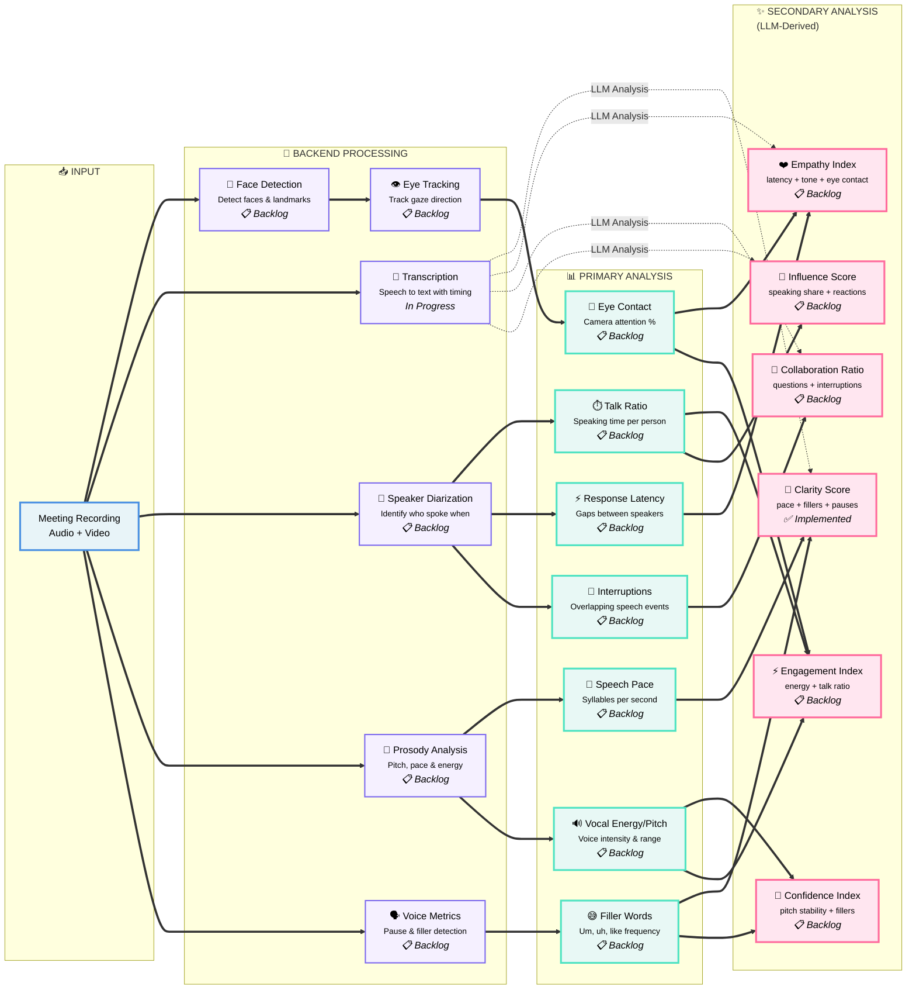

# Meeting Intelligence - Analysis Flow

This document describes the complete analysis pipeline from recording to insights.

## 🎯 Implementation Status

| Status | Description | Count |
|--------|-------------|-------|
| ✅ **Implemented** | Currently working in production | 1 |
| 🚧 **In Progress** | Actively being developed | 1 |
| 📋 **Backlog** | Planned for future implementation | 11 |

---

## 📊 Complete Analysis Flow



---

## 📥 INPUT STAGE

### Meeting Recording
- **Format**: Audio + Video (MP4, MOV, WebM)
- **Sources**: Zoom, Google Meet, in-person recordings
- **Storage**: Local filesystem → S3 (future)
- **Status**: ✅ **Implemented**

---

## 🔧 BACKEND PROCESSING

### 🎤 Transcription (🚧 In Progress)
**Purpose**: Convert speech to text with timing information

**Implementation**:
- **Current**: OpenAI Whisper API
- **Input**: Audio file (extracted via Python backend)
- **Output**: Text + timestamps
- **Accuracy**: ~95% for clear speech

**Technical Details**:
```python
# audio extraction
POST /api/video/extract-audio
→ Returns WAV file for transcription

# Send to Whisper
transcription = openai.audio.transcriptions.create(
    model="whisper-1",
    file=audio_file
)
```

**Status**: 🚧 **In Progress** (Basic implementation working, refinement needed)

---

### 🎥 Face Detection (📋 Backlog)
**Purpose**: Detect faces and facial landmarks in video frames

**Planned Implementation**:
- **Library**: OpenCV + MediaPipe
- **Output**: Face bounding boxes, 68 facial landmarks per face
- **Frame Rate**: 5 FPS (sufficient for meetings)

**Use Cases**:
- Eye contact tracking
- Attention detection
- Multi-person meetings

**Estimated Effort**: 2-3 days

---

### 👁️ Eye Tracking (📋 Backlog)
**Purpose**: Track gaze direction and camera attention

**Planned Implementation**:
- **Dependency**: Face Detection
- **Method**: Eye aspect ratio + gaze estimation
- **Output**: % of time looking at camera per person

**Use Cases**:
- Eye contact metrics
- Engagement scoring
- Attention analysis

**Estimated Effort**: 3-4 days (requires Face Detection first)

---

### 👥 Speaker Diarization (📋 Backlog)
**Purpose**: Identify who spoke when (speaker segmentation)

**Planned Implementation**:
- **Library**: pyannote.audio
- **Output**: Speaker segments with timestamps
- **Accuracy**: ~90% for 2-4 speakers

**Technical Details**:
```python
from pyannote.audio import Pipeline
pipeline = Pipeline.from_pretrained("pyannote/speaker-diarization")
diarization = pipeline(audio_file)
```

**Use Cases**:
- Talk ratio calculation
- Turn-taking analysis
- Individual speaker metrics

**Estimated Effort**: 2-3 days

---

### 🎵 Prosody Analysis (📋 Backlog)
**Purpose**: Analyze pitch, pace, and vocal energy

**Planned Implementation**:
- **Library**: librosa or praat-parselmouth
- **Metrics**: 
  - Pitch (F0) mean, range, variability
  - Speech rate (syllables/second)
  - Energy/intensity levels

**Use Cases**:
- Confidence scoring
- Engagement metrics
- Emotional state inference

**Estimated Effort**: 3-5 days

---

### 🗣️ Voice Metrics (📋 Backlog)
**Purpose**: Detect pauses, filler words, and speech patterns

**Planned Implementation**:
- **Pauses**: Voice Activity Detection (VAD)
- **Fillers**: Pattern matching on transcription
- **Patterns**: "um", "uh", "like", "you know", etc.

**Use Cases**:
- Clarity scoring
- Confidence metrics
- Speech coaching feedback

**Estimated Effort**: 2-3 days

---

## 📊 PRIMARY ANALYSIS

All primary metrics depend on backend processing components.

### ⏱️ Talk Ratio (📋 Backlog)
- **Requires**: Speaker Diarization
- **Calculation**: Speaking time per person / Total meeting time
- **Output**: Percentage per participant

### ⚡ Response Latency (📋 Backlog)
- **Requires**: Speaker Diarization
- **Calculation**: Time gap between speaker turns
- **Output**: Average latency in seconds

### 🏃 Speech Pace (📋 Backlog)
- **Requires**: Prosody Analysis + Transcription
- **Calculation**: Syllables per second
- **Output**: Words per minute (WPM)

### 😅 Filler Words (📋 Backlog)
- **Requires**: Voice Metrics + Transcription
- **Calculation**: Count of filler words / Total words
- **Output**: Percentage and frequency

### 🔊 Vocal Energy/Pitch (📋 Backlog)
- **Requires**: Prosody Analysis
- **Calculation**: Mean pitch, pitch range, energy levels
- **Output**: Normalized scores

### 👀 Eye Contact (📋 Backlog)
- **Requires**: Eye Tracking
- **Calculation**: % of time looking at camera
- **Output**: Percentage per participant

### 🔀 Interruptions (📋 Backlog)
- **Requires**: Speaker Diarization
- **Calculation**: Count of overlapping speech events
- **Output**: Interruption count and rate

---

## ✨ SECONDARY ANALYSIS (LLM-Derived)

These are high-level insights derived from primary metrics and LLM analysis.

### 💬 Clarity Score (✅ Implemented)
**Formula**: Combination of pace + fillers + pauses

**Current Implementation**:
- ✅ LLM-based analysis of transcription
- 📋 Will enhance with: Speech pace, filler frequency, pause patterns

**Output**: Score 0-100

---

### ❤️ Empathy Index (📋 Backlog)
**Formula**: Response latency + tone + eye contact

**Planned Implementation**:
- Response timing patterns
- Vocal tone analysis
- Eye contact during listening
- LLM sentiment analysis

**Estimated Effort**: 4-5 days (after dependencies)

---

### 💪 Confidence Index (📋 Backlog)
**Formula**: Pitch stability + filler frequency

**Planned Implementation**:
- Pitch variance analysis
- Filler word detection
- Speaking pace consistency
- Volume/energy patterns

**Estimated Effort**: 3-4 days (after dependencies)

---

### 🧩 Collaboration Ratio (📋 Backlog)
**Formula**: Questions asked + interruption patterns

**Planned Implementation**:
- Question detection (LLM)
- Turn-taking analysis
- Interruption context (supportive vs. disruptive)

**Estimated Effort**: 2-3 days (after dependencies)

---

### ⚡ Engagement Index (📋 Backlog)
**Formula**: Vocal energy + talk ratio + eye contact

**Planned Implementation**:
- Energy level tracking
- Speaking participation
- Visual attention metrics

**Estimated Effort**: 2-3 days (after dependencies)

---

### 🤝 Influence Score (📋 Backlog)
**Formula**: Speaking share + reactions from others

**Planned Implementation**:
- Speaking time analysis
- Response patterns from others
- Topic initiation tracking
- LLM leadership analysis

**Estimated Effort**: 4-5 days (after dependencies)

---

## 🗺️ Development Roadmap

### Phase 1: Foundation (Current)
- ✅ Basic transcription (Whisper)
- ✅ LLM-based clarity analysis
- 🚧 Audio extraction (Python backend)
- 🚧 Transcription refinement

### Phase 2: Core Audio Processing (Next)
- 📋 Speaker Diarization
- 📋 Voice Metrics (pauses, fillers)
- 📋 Talk Ratio
- 📋 Filler Word Detection

**Estimated Time**: 2-3 weeks

### Phase 3: Advanced Audio Analysis
- 📋 Prosody Analysis
- 📋 Speech Pace
- 📋 Vocal Energy/Pitch
- 📋 Response Latency
- 📋 Interruption Detection

**Estimated Time**: 3-4 weeks

### Phase 4: Video Processing
- 📋 Face Detection
- 📋 Eye Tracking
- 📋 Eye Contact Metrics

**Estimated Time**: 2-3 weeks

### Phase 5: Secondary Metrics
- 📋 Empathy Index
- 📋 Confidence Index
- 📋 Collaboration Ratio
- 📋 Engagement Index
- 📋 Influence Score

**Estimated Time**: 2-3 weeks

---

## 🔧 Technical Architecture

### Current Stack
- **Frontend**: Next.js (TypeScript)
- **Backend (Node.js)**: API routes, LLM integration
- **Backend (Python)**: FastAPI for video/audio processing
- **AI Models**: 
  - OpenAI Whisper (transcription)
  - GPT-4 (analysis)

### Future Stack Additions
- **pyannote.audio**: Speaker diarization
- **librosa**: Audio analysis
- **OpenCV + MediaPipe**: Video analysis
- **Praat/Parselmouth**: Prosody analysis

---

## 📊 Data Flow

```
Recording Upload
    ↓
Python Backend: Extract Audio
    ↓
Transcription (Whisper)
    ↓
LLM Analysis (GPT-4)
    ↓
Clarity Score ✅
    ↓
[Future: All other metrics]
    ↓
Display in UI
```

---

## 🎯 Priority Order

1. **Critical**: Complete transcription pipeline
2. **High**: Speaker diarization (enables multiple metrics)
3. **High**: Voice metrics (fillers, pauses)
4. **Medium**: Prosody analysis
5. **Medium**: Face detection + eye tracking
6. **Low**: Advanced secondary metrics

---

## 📝 Notes

- Dashed lines (`.->`) represent LLM-based analysis connections
- Solid lines (`==>`) represent direct data dependencies
- All secondary metrics benefit from LLM enhancement
- Python backend handles CPU-intensive processing
- Node.js backend handles API orchestration and LLM calls

---

## 🚀 Getting Started

To implement a new metric:

1. **Backend Processing**: Add Python endpoint if needed
2. **Primary Analysis**: Calculate raw metrics
3. **Secondary Analysis**: Combine with LLM insights
4. **Frontend**: Display in UI
5. **Testing**: Validate with sample recordings

See `INTEGRATION_EXAMPLES.md` for code examples.

